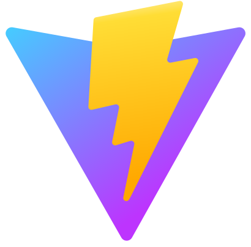

# Hi, I'm José Victor !

Nice to meet you! I started programming in 2017 and graduated as a Computer Technician at the IFRN. I want to be a great developer and I am every day studying and striving more and more to become one.

## About me

- ✒️ Interface and front-end design are my passions.
- 💪 Efficient methods, agility and teamwork.
- 📚 Learning more and more.
- 🤖 Every day consuming on technology.

## Technology History

> 
> 
> 
> 
> 
> 
> 
> 
> 
> 
> 
> 
> 

## Talk to me

- <a href="https://www.josevictor.dev/" target="_blank">Portfólio</a>
- <a href="https://www.linkedin.com/in/jos%C3%A9-victor-dev/" target="_blank">LinkedIn</a>
- <a href="https://www.instagram.com/victor_mdrss/" target="_blank">Instagram</a>
- <a href="mailto:josevictordev@gmail.com?subject=Hello" target="_blank">Gmail</a>
- <a href="https://www.figma.com/@victormedeiros1" target="_blank">Figma</a> 
